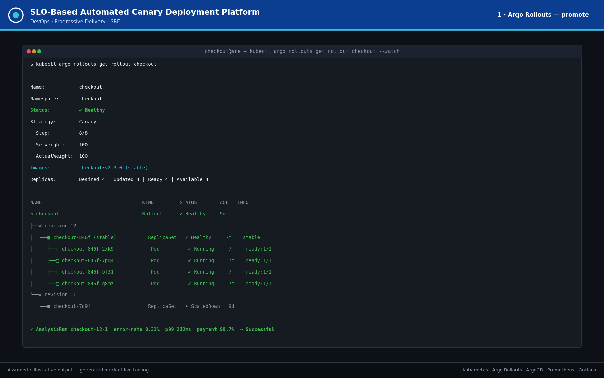
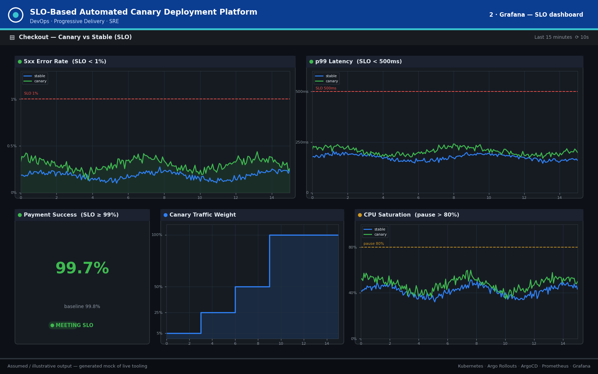
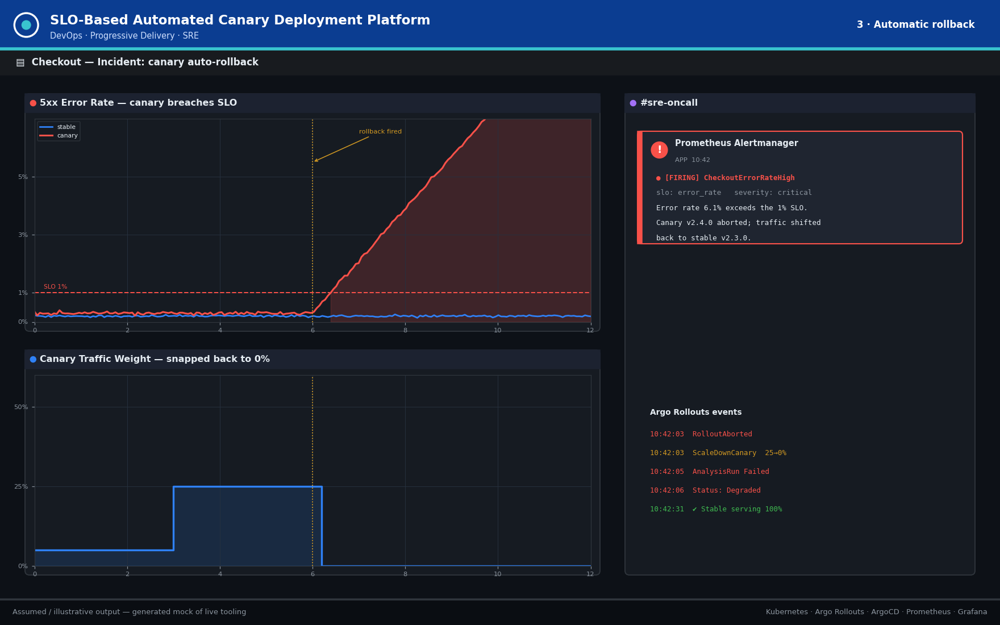
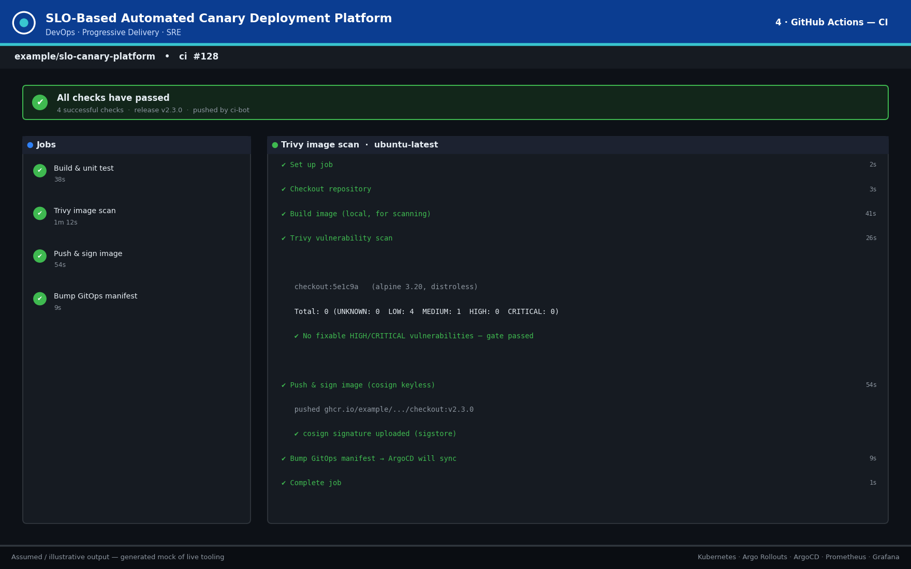
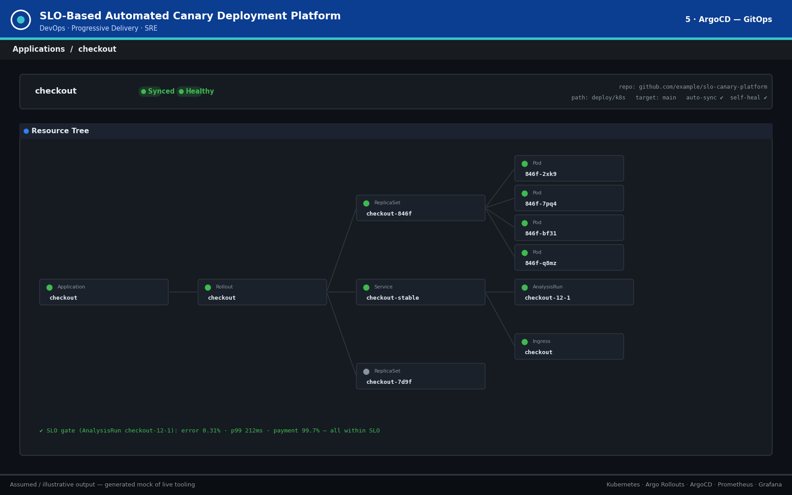
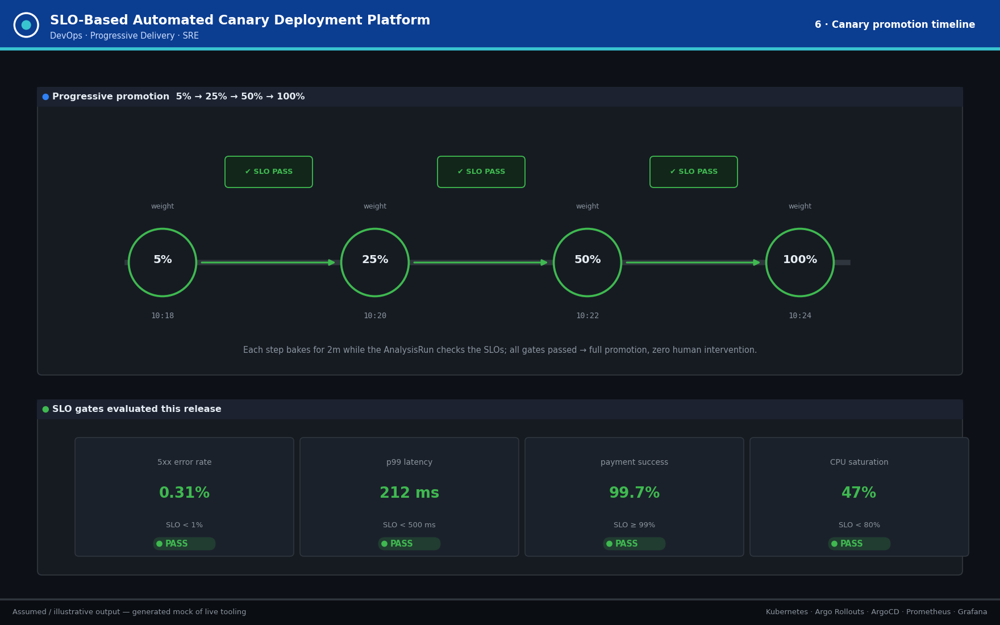
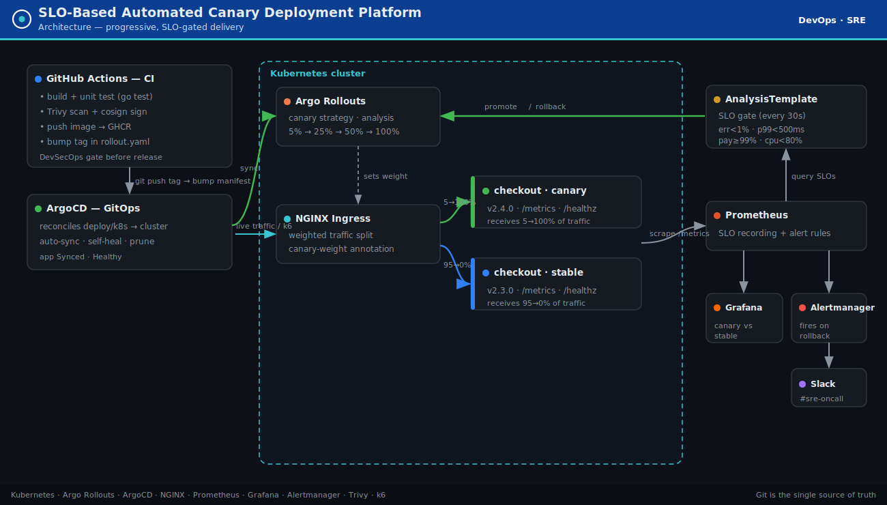

# SLO-Based Automated Canary Deployment Platform

> A self-governing release system that protects production using **live reliability signals**.
> A new version receives a small slice of live traffic and must continuously prove it is healthy
> against defined Service Level Objectives (SLOs) before earning more — otherwise it is **rolled
> back automatically within seconds**, with no human watching dashboards.

```
Deploy canary (5%)  →  Compare vs stable  →  SLO check  →  Promote (5→25→50→100%) or Roll back
```

<p>


</p>

---

## 📸 Preview (what the platform produces)

> ⚠️ These are **assumed / illustrative** mockups of what the live tooling would show — generated by
> [`scripts/generate_output_images.py`](scripts/generate_output_images.py). Click each tab to expand;
> regenerate with `python scripts/generate_output_images.py`.

<details open>
<summary><b>① Argo Rollouts — healthy, fully promoted</b></summary>



`kubectl argo rollouts get rollout checkout` after all SLO gates passed and traffic reached 100%.
</details>

<details>
<summary><b>② Grafana — canary vs stable SLO dashboard</b></summary>



Error rate, p99 latency, payment success, canary traffic weight and CPU — canary compared to stable.
</details>

<details>
<summary><b>③ Automatic rollback — error spike → Slack alert</b></summary>



Canary 5xx rate crosses the 1% SLO, traffic is snapped back to 0%, and Alertmanager posts to Slack.
</details>

<details>
<summary><b>④ GitHub Actions — CI pipeline run</b></summary>



build → unit test → Trivy scan → cosign sign & push → bump GitOps manifest.
</details>

<details>
<summary><b>⑤ ArgoCD — synced & healthy resource tree</b></summary>



GitOps view: Application → Rollout → ReplicaSets → Pods / Service / Ingress / AnalysisRun.
</details>

<details>
<summary><b>⑥ Canary promotion timeline</b></summary>



5% → 25% → 50% → 100% with an `✔ SLO PASS` gate between every step.
</details>

---

## Table of contents

0. [📸 Preview (screenshots)](#-preview-what-the-platform-produces)
1. [Problem statement](#1-problem-statement)
2. [Limitations of existing approaches](#2-limitations-of-existing-approaches)
3. [How this system solves it](#3-how-this-system-solves-it)
4. [Architecture](#4-architecture)
5. [Tech stack](#5-tech-stack)
6. [SLO definitions](#6-slo-definitions)
7. [Repository layout](#7-repository-layout)
8. [The sample service](#8-the-sample-service)
9. [Prerequisites](#9-prerequisites)
10. [Step-by-step setup & run](#10-step-by-step-setup--run)
11. [Demo: trigger an automatic rollback](#11-demo-trigger-an-automatic-rollback)
12. [Expected output (screenshots)](#12-expected-output-screenshots)
13. [Implementation phases](#13-implementation-phases)
14. [Troubleshooting](#14-troubleshooting)
15. [Skills demonstrated](#15-skills-demonstrated)

---

## 1. Problem statement

For most digital businesses, the single largest **controllable** cause of production incidents is
*change* — deploying new code. A defective release in a revenue-critical service (checkout,
authentication, payments) can degrade the experience for the **entire** user base within seconds
of going live.

> **Core business pain:** A faulty deploy that raises the error rate of a checkout service to 5%
> can silently destroy thousands of dollars in revenue per minute before any human notices,
> diagnoses, and reverses it.

The cost is not only revenue — it includes SLA-breach penalties, customer churn, on-call burnout
from late-night manual rollbacks, and erosion of trust in the team's ability to ship safely.

**Who feels this pain**

- **SRE / Platform teams** — accountable for uptime but forced to babysit every release.
- **Product engineering teams** — slowed down because shipping feels dangerous.
- **Business stakeholders** — exposed to direct revenue loss and reputational damage.

---

## 2. Limitations of existing approaches

| Existing approach | How it works | Critical limitation |
|---|---|---|
| **Blue-Green** | Switches 100% of traffic from old to new at once | A defect hits **every** user instantly — zero gradual exposure |
| **Manual canary** | Engineer releases to a few users, watches dashboards by hand | Slow, inconsistent, gut-feel; impossible to scale across services |
| **Basic CI/CD** | Marks deploy "successful" when the container starts | "Container started" ≠ "version is healthy" |
| **Simple health checks** | Pings an endpoint to confirm the app is alive | Can't detect degraded behaviour — slow responses, rising errors |

> **The fundamental gap:** existing tooling treats deployment as a binary *"did it start?"* event.
> None answer the question that actually matters: *"is the new version behaving worse than the old
> one for real users, **right now**?"*

---

## 3. How this system solves it

The platform introduces **progressive, SLO-gated delivery**. Instead of releasing to everyone, the
new version receives a small slice of live traffic and must continuously *prove* it is healthy
before earning more.

1. The new version is deployed **alongside** the stable version and receives ~**5%** of traffic.
2. The platform continuously compares the canary against the stable baseline on live signals:
   **error rate, p99 latency, CPU, and the business metric — successful payment rate.**
3. These signals are evaluated against pre-defined SLOs by an **Argo Rollouts AnalysisTemplate**.
   If the canary breaches any SLO, traffic is **automatically pulled back** and on-call is alerted
   — within seconds, not minutes.
4. If the canary stays healthy, traffic is promoted automatically in stages: **5% → 25% → 50% → 100%**.

> **Business outcome:** the release decision becomes automatic and evidence-based. A bad version is
> contained to ~5% of users and reversed in seconds; a good version ships with zero human supervision.

| Capability | How it is implemented |
|---|---|
| Progressive traffic shifting | Argo Rollouts canary strategy + NGINX ingress canary-weight |
| Automated SLO gate | Argo Rollouts `AnalysisTemplate` querying Prometheus every 30s |
| Automatic rollback | A single SLO breach aborts the rollout and shifts traffic back to stable |
| GitOps delivery | ArgoCD reconciles the cluster to Git; CI bumps the image tag to trigger a release |
| DevSecOps gate | Trivy scan + cosign signing in CI; secrets only as Sealed Secrets |
| Observability | Prometheus SLO rules, Grafana canary-vs-stable dashboard, Alertmanager → Slack |

---

## 4. Architecture



<details>
<summary>Text version (ASCII)</summary>

```
                 GitHub Actions CI                          ArgoCD (GitOps)
   ┌───────────────────────────────────┐         ┌───────────────────────────┐
   │ build → test → Trivy → sign → push │   tag   │ reconcile deploy/k8s → cluster
   │            bump manifest ──────────┼────────▶│ Rollout / Analysis / Svc / Ingress
   └───────────────────────────────────┘         └─────────────┬─────────────┘
                                                                ▼
   NGINX ingress  ──split 5/25/50/100──▶   ┌─ checkout (canary)  ─┐
                                           └─ checkout (stable)  ─┘
                                                   │ /metrics
                                                   ▼
                 Prometheus ──rules──▶ AnalysisTemplate (SLO gate) ──▶ promote / rollback
                      │                                                      │
                   Grafana                                            Alertmanager → Slack
```

</details>

---

## 5. Tech stack

| Lifecycle stage | Tool(s) | Role here |
|---|---|---|
| Code | Go | Sample checkout microservice + Prometheus metrics |
| Build / containerize | Docker (multi-stage, distroless) | Immutable, non-root image |
| CI | GitHub Actions | build → test → scan → sign → push → bump manifest |
| Security (DevSecOps) | Trivy, cosign, Sealed Secrets | CVE gate, image signing, encrypted secrets |
| IaC | Terraform | Cluster skeleton (minikube local / EKS stub) |
| Orchestration | Kubernetes | Runs stable + canary workloads |
| Progressive delivery | **Argo Rollouts** | Core engine — traffic shift + auto promote/rollback |
| Traffic | NGINX ingress | Enforces 5/25/50/100 split at the edge |
| GitOps | ArgoCD | Git = single source of truth |
| Monitoring | Prometheus, Grafana | SLO signals + canary-vs-stable dashboard |
| Alerting | Alertmanager + Slack | On-call notified the instant a rollback fires |
| Load testing | k6 | Generates traffic to exercise the canary |

---

## 6. SLO definitions

| Metric | Threshold | Action on breach |
|---|---|---|
| 5xx error rate | `< 1%` rolling | automatic rollback |
| latency p99 | `< 500 ms` | automatic rollback |
| payment success rate | `≥ 99%` of baseline | automatic rollback |
| CPU saturation | `< 80%` | pause promotion + alert |

The metric names are defined **once** in [`app/metrics.go`](app/metrics.go) and referenced
identically by [`observability/prometheus/slo-rules.yaml`](observability/prometheus/slo-rules.yaml),
[`deploy/k8s/analysistemplate.yaml`](deploy/k8s/analysistemplate.yaml) and the Grafana dashboard —
so the gate, the alerts and the dashboard can never drift apart.

---

## 7. Repository layout

```
app/                       Go checkout microservice (+ Prometheus metrics, unit tests)
Dockerfile                 multi-stage, distroless, non-root
deploy/k8s/                namespace, services, ingress, Rollout, AnalysisTemplate, kustomization
deploy/argocd/             ArgoCD Application (GitOps owner)
observability/             Prometheus config + SLO rules, Grafana dashboard, Alertmanager
security/                  Trivy config, Sealed Secret example
load/                      k6 load test that exercises the canary
infra/terraform/           cluster skeleton (minikube local / EKS stub)
.github/workflows/ci.yaml  CI: build → test → scan → sign → push → bump manifest
scripts/                   output-image generator
docs/                      use case + generated screenshots
```

---

## 8. The sample service

A small Go HTTP service ([`app/`](app)) that simulates a checkout/payment endpoint:

| Endpoint | Purpose |
|---|---|
| `POST /checkout` | Business endpoint; drives `payment_attempts_total` / `payment_success_total` |
| `GET /healthz` | Liveness probe |
| `GET /readyz` | Readiness probe |
| `GET /metrics` | Prometheus metrics |

Two env knobs let a deployment **deliberately behave like a bad canary**, so the SLO gate can be
demonstrated end-to-end:

| Env var | Effect |
|---|---|
| `ERROR_RATE` | probability `[0,1]` that `/checkout` returns `500` |
| `EXTRA_LATENCY_MS` | extra latency (ms) injected into `/checkout` |
| `VERSION` | label that distinguishes stable from canary in metrics |

---

## 9. Prerequisites

Install these CLIs first (versions are a known-good baseline):

| Tool | Why | Install |
|---|---|---|
| Docker | build/run the image | https://docs.docker.com/get-docker/ |
| kubectl | talk to the cluster | https://kubernetes.io/docs/tasks/tools/ |
| minikube | local cluster | https://minikube.sigs.k8s.io/docs/start/ |
| Helm 3 | install controllers | https://helm.sh/docs/intro/install/ |
| Argo Rollouts kubectl plugin | `kubectl argo rollouts ...` | https://argo-rollouts.readthedocs.io/en/stable/installation/#kubectl-plugin-installation |
| Terraform | provision the cluster | https://developer.hashicorp.com/terraform/install |
| k6 | load generation | https://grafana.com/docs/k6/latest/set-up/install-k6/ |
| Go 1.22+ | build/test locally (optional) | https://go.dev/dl/ |

> Everything below targets a local **minikube** cluster so it costs nothing. The Terraform `eks`
> profile is a documented stub for a cloud build.

---

## 10. Step-by-step setup & run

### Step 0 — Clone

```bash
git clone https://github.com/example/slo-canary-platform.git
cd slo-canary-platform
```

### Step 1 — (Optional) build & test the app locally

```bash
cd app
go mod tidy          # resolves dependencies and writes go.sum
go vet ./...
go test ./... -v
cd ..
```

### Step 2 — Provision the cluster (Terraform → minikube)

```bash
cd infra/terraform
terraform init
terraform apply -auto-approve          # creates a minikube cluster with ingress + metrics-server
cd ../..
kubectl get nodes                      # verify the node is Ready
```

> Prefer to skip Terraform? `minikube start --addons=ingress,metrics-server` is equivalent.

### Step 3 — Install the platform controllers (one-time)

```bash
# 3a. Argo Rollouts (the progressive-delivery engine)
kubectl create namespace argo-rollouts
kubectl apply -n argo-rollouts \
  -f https://github.com/argoproj/argo-rollouts/releases/latest/download/install.yaml

# 3b. Prometheus + Grafana + Alertmanager (kube-prometheus-stack)
helm repo add prometheus-community https://prometheus-community.github.io/helm-charts
helm repo update
kubectl create namespace monitoring
helm install kps prometheus-community/kube-prometheus-stack -n monitoring

# 3c. ArgoCD (GitOps)
kubectl create namespace argocd
kubectl apply -n argocd \
  -f https://raw.githubusercontent.com/argoproj/argo-cd/stable/manifests/install.yaml

# 3d. Sealed Secrets controller (so secrets are never committed in plaintext)
helm repo add sealed-secrets https://bitnami-labs.github.io/sealed-secrets
helm install sealed-secrets sealed-secrets/sealed-secrets -n kube-system
```

### Step 4 — Wire configuration

1. **Prometheus address used by the SLO gate.** Confirm the in-cluster Prometheus service name and
   update it in [`deploy/k8s/analysistemplate.yaml`](deploy/k8s/analysistemplate.yaml) if needed:

   ```bash
   kubectl get svc -n monitoring | grep prometheus
   # kube-prometheus-stack default → kps-kube-prometheus-prometheus.monitoring.svc.cluster.local:9090
   ```

   ```yaml
   # analysistemplate.yaml
   args:
     - name: prometheus-addr
       value: http://kps-kube-prometheus-prometheus.monitoring.svc.cluster.local:9090
   ```

2. **Slack webhook (alerting).** Seal your real webhook URL and apply it — the plaintext never
   touches Git:

   ```bash
   kubectl create secret generic alertmanager-slack \
     --namespace monitoring \
     --from-literal=slack-webhook-url='https://hooks.slack.com/services/XXX/YYY/ZZZ' \
     --dry-run=client -o yaml \
   | kubeseal --controller-name sealed-secrets --controller-namespace kube-system -o yaml \
     > security/secrets/sealed-secret.yaml

   kubectl apply -f security/secrets/sealed-secret.yaml
   ```

3. **Image registry.** The Rollout pulls `ghcr.io/example/slo-canary-checkout/checkout`. Point it
   at your own registry in [`deploy/k8s/rollout.yaml`](deploy/k8s/rollout.yaml) and in the CI
   `IMAGE` env in [`.github/workflows/ci.yaml`](.github/workflows/ci.yaml), or build locally into
   minikube:

   ```bash
   eval $(minikube docker-env)        # build straight into the cluster's Docker
   docker build -t ghcr.io/example/slo-canary-checkout/checkout:v2.3.0 .
   ```

### Step 5 — Deploy the app, Rollout and SLO gate

```bash
kubectl apply -k deploy/k8s                       # namespace, services, ingress, Rollout, AnalysisTemplate
kubectl apply -f deploy/argocd/application.yaml    # ArgoCD now owns deploy/k8s via GitOps
```

### Step 6 — Observe

```bash
# Watch the rollout make its own promotion decisions:
kubectl argo rollouts get rollout checkout -n checkout --watch

# Grafana (admin / get the password below) → import observability/grafana/canary-dashboard.json
kubectl get secret kps-grafana -n monitoring -o jsonpath='{.data.admin-password}' | base64 -d
kubectl port-forward -n monitoring svc/kps-grafana 3000:80

# ArgoCD UI:
kubectl port-forward -n argocd svc/argocd-server 8080:443
```

Add a hosts entry so the ingress host resolves:

```bash
echo "$(minikube ip) checkout.local" | sudo tee -a /etc/hosts
```

### Step 7 — Generate traffic

```bash
k6 run -e BASE_URL=http://checkout.local load/k6-canary-test.js
```

### Step 8 — Ship a new version (triggers the canary)

In real life CI does this: pushing a `v*` tag builds/scans/signs the image and bumps the tag in
`deploy/k8s/rollout.yaml`; ArgoCD syncs the change; Argo Rollouts starts the SLO-gated canary.
Locally you can trigger it directly:

```bash
kubectl argo rollouts set image checkout \
  checkout=ghcr.io/example/slo-canary-checkout/checkout:v2.4.0 -n checkout
kubectl argo rollouts get rollout checkout -n checkout --watch
```

A healthy version walks `5% → 25% → 50% → 100%` automatically.

---

## 11. Demo: trigger an automatic rollback

Ship a version that breaches the error-rate SLO (6% > 1%) and watch it roll back on its own:

```bash
# Make the canary fail 6% of checkouts:
kubectl argo rollouts set image checkout \
  checkout=ghcr.io/example/slo-canary-checkout/checkout:v2.4.0 -n checkout
kubectl patch rollout checkout -n checkout --type=merge -p \
  '{"spec":{"template":{"spec":{"containers":[{"name":"checkout","env":[{"name":"ERROR_RATE","value":"0.06"}]}]}}}}'

kubectl argo rollouts get rollout checkout -n checkout --watch
```

Expected: the AnalysisRun reports `error-rate` above 1% → the Rollout status flips to **Degraded**,
traffic snaps back to **0%** canary, and Alertmanager fires `CheckoutErrorRateHigh` to `#sre-oncall`.

---

## 12. Expected output (screenshots)

See the [📸 Preview](#-preview-what-the-platform-produces) section at the top of this README for all
six screenshots (Argo Rollouts, Grafana, automatic rollback, GitHub Actions, ArgoCD, promotion
timeline). Regenerate them with `python scripts/generate_output_images.py`.

---

## 13. Implementation phases

| Phase | Deliverable | Tools | Outcome |
|---|---|---|---|
| 1 | Cluster + microservice + CI build | Terraform, Docker, GitHub Actions, Kubernetes | Baseline deployable app |
| 2 | Observability stack | Prometheus, Grafana, Alertmanager | Live visibility into health |
| 3 | Traffic splitting + manual canary | Argo Rollouts, NGINX | Progressive traffic works |
| 4 | Automated SLO analysis gates | Argo Rollouts AnalysisTemplate | Auto promote/rollback — **core feature** |
| 5 | GitOps + security + load testing | ArgoCD, Trivy, Sealed Secrets, k6 | Production-grade platform |

---

## 14. Troubleshooting

| Symptom | Likely cause / fix |
|---|---|
| AnalysisRun stuck `Inconclusive` | Wrong `prometheus-addr` in `analysistemplate.yaml` — check the service name (Step 4.1) |
| No metrics in Prometheus | Pod scrape annotations missing, or wrong namespace in `prometheus.yaml` scrape config |
| Ingress 404 / host not resolving | Add the `minikube ip → checkout.local` line to `/etc/hosts` (Step 6) |
| Rollout never promotes | A gate is failing — `kubectl argo rollouts get rollout checkout --watch` shows which metric |
| Slack alert not firing | Sealed Secret not applied or webhook URL invalid (Step 4.2) |
| CI fails on `go.sum` | First run does `go mod tidy`; commit the generated `app/go.sum` |

---

## 15. Skills demonstrated

Kubernetes · Go · Docker · Terraform (IaC) · Argo Rollouts · ArgoCD (GitOps) · NGINX traffic
splitting · Prometheus / Grafana · Alertmanager · DevSecOps (Trivy / cosign / Sealed Secrets) ·
k6 load testing · SRE · observability · risk-aware progressive delivery.

---

*Business use case: [`docs/canary_platform_doc.md`](docs/canary_platform_doc.md).*
